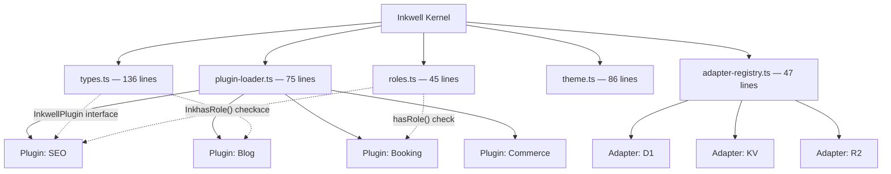

Inkwell started as a single `index.ts` file, 401 lines. That was the right call for the first sprint. One file means one place to look, no abstraction overhead, and no decisions to make about where things live.

By the time we hit 15 route files and 12 features, that clarity was gone.

## The Wall

The symptom wasn't complexity — it was dead code. Every fork of Inkwell for a new vertical (dental booking, grant management, e-commerce) carried all the routes, handlers, and business logic for verticals that fork would never use. A dental site had grant-search code sitting there, never called, just loaded.

Worse: plugin authors had no contract. If you wanted to add a feature to Inkwell, you edited the core. There was no boundary.

We evaluated four ways out.

## The Four Approaches

| Approach | Description | Build Time | Fork Complexity | Risk |
|----------|-------------|------------|-----------------|------|
| **A: Feature flags** | Config-driven enable/disable per vertical | Low | Medium — flags accumulate | High — dead code stays in bundle |
| **B: Plugin directory** | Each feature is a folder with a manifest | Medium | Low — clone + drop folder | Low — unused plugins don't load |
| **C: npm packages** | Each feature published as a package | High | High — versioning, publish friction | Medium — dependency hell at scale |
| **D: Astro integrations** | First-class Astro integration API per feature | High | Low if ecosystem matures | High — tight coupling to Astro version |

We chose B. Not because it was architecturally pure, but because it matched our team size and pace. One person can maintain a plugin directory. Publishing npm packages for internal features adds coordination overhead that a two-person team can't absorb.

## What We Extracted

The kernel isn't clever. It's just the code that every plugin needs to call and that no plugin should own.

Total kernel: **430 lines**. Each file has one job:

- `types.ts` — the `InkwellPlugin` interface, `InkwellConfig`, `InkwellRole`. Every plugin implements this interface.
- `plugin-loader.ts` — reads the plugins directory, validates each manifest, registers routes with the Hono router.
- `adapter-registry.ts` — maps storage operations to whatever binding is available (D1, KV, R2). Plugins call `registry.get('db')`, not `env.DB`.
- `theme.ts` — color tokens, font config, spacing scale. One source of truth for design decisions shared across plugins.
- `roles.ts` — role hierarchy, `hasRole()`, `requireRole()` middleware. More on this in the next post.

## The Rule We Set

If the kernel grows past 500 lines, something in it belongs in a plugin.

This rule has caught two things already. We started pulling nav-rendering logic into the kernel because it felt "shared." It's not — it's a concern for the shell plugin. We moved it. The kernel stayed at 430.

O'Reilly's "Software Architecture Patterns" names the microkernel pattern exactly: a core system plus plug-in modules, where the core provides the minimum functionality required to be operational. The Shopify team wrote about a similar problem when composing their storefront — features that feel universal eventually become vertical-specific baggage.

## What Changed After

Plugin authors now have a contract. Your plugin implements `InkwellPlugin`. It exports routes, a manifest with a `requiredRole`, and optionally a nav item. The loader does the rest.

Forking Inkwell for a new vertical means: clone the repo, delete the plugin folders you don't need, add the ones you do. The kernel is untouched.

The monolith didn't go away — it became the kernel. And the kernel is small enough to hold in your head.
