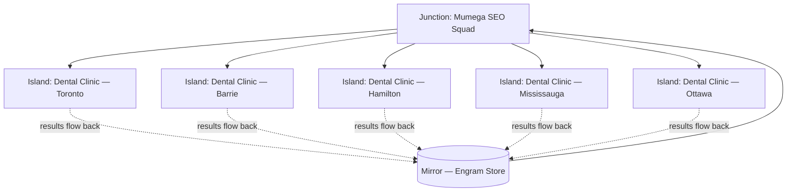

Most agency relationships look like islands. A marketing agency works with a dental client. They learn that clinic's tone, competitive set, and local keywords. The engagement ends. The knowledge evaporates. The next dental client starts from zero.

We noticed this pattern while running AI squads across three of our own projects — TROP, DNU (DentalNearYou), and Viamar. Each project is different enough to feel distinct, but the SEO patterns, the content structures, the audience segments — they overlap. The squads doing the work were accumulating knowledge. We just weren't making it compound.

That observation led to what we're calling the island-junction model.

## The Traditional Agency Structure

In a traditional agency engagement, knowledge is locked to the relationship. The agency charges a monthly retainer — typically $3,000–$8,000 for a mid-market SEO engagement — and deploys human labor that relearns the vertical for each new client.

The labor cost doesn't scale down as the client count goes up. Hiring a new SEO manager doesn't make the existing SEO manager more effective on their current clients. Knowledge is siloed by account.

## What the Junction Changes

A junction is a shared squad serving multiple clients in the same vertical. Instead of one agency serving one dental client for $5,000/month, five dental clinics share one SEO squad at $1,000/month each. Same squad, same monthly revenue, five clients served.

The squad serves all five. Mirror stores what the squad learns from each. The next client in the vertical starts with that accumulated knowledge — not from zero.

## The Bayesian Part (Kept Simple)

Bayesian inference is about updating beliefs with evidence. Start with a prior — your best guess about what works. Observe outcomes. Update.

For an SEO squad serving dental clinics in Ontario:

- Prior: "location + service + 'near me' keywords tend to convert"
- Evidence from client 1 (Toronto): "emergency dental" outperforms "dental clinic" by 2.3x in this market
- Evidence from client 2 (Barrie): similar pattern, "emergency" modifier lifts CTR consistently
- Evidence from client 3–5: the pattern holds across the vertical

After ten dental clients, the squad isn't guessing what content structure converts. It knows, with data behind it. The posterior — `P(strategy works | dental, Ontario)` — has been updated ten times with real outcomes.

A new dental client joining the junction starts with that posterior as their prior. They don't pay for the squad to relearn the vertical. They pay for the squad's accumulated knowledge applied to their specific context.

| Metric | Traditional Agency | Junction Model |
|--------|-------------------|----------------|
| Cost per client/month | $3K–$8K | $800–$1.5K |
| Knowledge at engagement start | Zero (relearned) | Vertical posterior from prior clients |
| Learning accumulation | Per account, siloed | Shared across vertical |
| Client 10 vs. client 1 quality | Same | Meaningfully better |
| Squad headcount growth with clients | Linear | Sub-linear |
| Knowledge portability when engagement ends | None | Stays in Mirror |

## Where Mirror Fits

Mirror is our memory layer — engrams stored as vectors in Supabase pgvector. When an SEO squad completes a task for a dental client, the result — what worked, what didn't, what the content structure looked like — is stored as an engram tagged with the vertical and geography.

When the next dental client onboards, the squad's first context retrieval pulls those engrams. "What do we know about dental SEO in Ontario mid-sized cities?" returns structured knowledge from prior engagements, not a blank page.

This is the compounding mechanism. Without it, the junction is just discounted agency work. With it, the junction becomes more valuable over time in ways that isolated agencies can't replicate.

## The Analogy That Fits

Uber doesn't own cars. Mumega doesn't own agents. Both match supply — workers, squads — with demand — riders, businesses — and take a cut for the coordination.

Uber's value compounds because more drivers means shorter wait times, which means more riders, which means more drivers. The network effect is supply-demand density.

Mumega's value compounds differently: more clients in a vertical means a smarter squad for that vertical, which means better outcomes, which means more clients refer in. The network effect is knowledge density.

The take rate we're targeting is 5% of what the client pays — not a markup on labor, but a fee for accessing the junction and the accumulated vertical knowledge it holds.

## What We Observed Running This

We didn't design this pattern in advance. We noticed it running three projects through the same squads. The SEO squad that worked on DentalNearYou's content structure produced noticeably better first-draft work when we pointed it at Viamar's dental vertical pages. The squad wasn't starting over — it was applying what it had learned.

The observation was: shared squads serving related verticals produce compounding returns that isolated engagements don't. The model followed the observation.

We're not the first to see network effects in marketplaces. We're just applying the same logic to knowledge work — where the asset being compounded isn't liquidity or supply density, but vertical expertise stored in a memory layer.

Whether that compounds the way we think it will at 50 clients, 500 clients — that's an empirical question. We'll find out.
